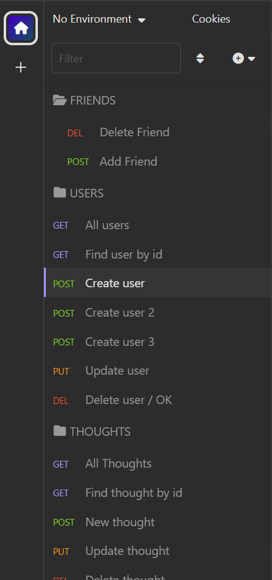

# Social Network API 

  ## Description
    This is a project that simulates a database of a Social Network application using NoSql and Insonmia.
    The purpose of this application is to create an API where you can manipulate users' data and their thoughts and/or reactions using the back-end interface.
  
  ## Table of Contents
  - [Installation](#installation)
  - [Usage](#usage)
  - [License](#license)
  - [Contributing](#contributing)
  - [Tests](#tests)
  - [Questions](#questions)
  
  ## Installation

  Navigate to https://github.com/robinsonfdossantos/Social-Network-NoSql.

  Open a local built-in Terminal (powershell, bash) on your local machine.

  Navigate to a desired folder to place your project in, using 'cd "folder"'.

  Use 'git clone' to copy the repository to your local computer by typing "git clone git@github.com:robinsonfdossantos/Social-Network-NoSql.git".
  
  ## Usage

  Run the terminal built into VS Code. Make sure you have installed all required packages using 'npm install or npm i'.

  In order to start testing the API, you have to populate its database with few examples that were inserted into seeds.js. Run the command 'npm run seed' to executed this functionality.

  When all the packages are installed and the database populated, it is time to start the application, so you  should run the command 'npm start'.

  To confirm the application has loaded, the console will display a message to inform you the application is running locally on the localhost 3001 as shown the in the image below.

  

  All good, now you have executed the API and already have some data to start interacting with the database. So, it is time to open Insomnia .
  
  When you open Insomnia, it is time to start testing your routes. To ensure that you are using the routes correctly, you can check the files 'thoughtRoutes.js' and 'userRoutes.js' located at '../routes/api/' and check how the routes were settled.

  Firstly, it is a good idea you organize your routes in order to easily understand how the processes will work and also set how the data will be shown, for exemple, when you create a new user you thought you should set Insonmia to insert the data as JSON. The following illustrations show how it should look like.
  
   

  The following link is related to a video of the application in operation, watching it you will be able to go through the options provided by the application and also follow the steps to start the application if you still have doubts.

  >>>>>>>>>>>>>>>>> VIDEO HERE 

  
  ## License
  This application is covered under the MIT license.
  
  ## Contributing
  All users are very welcome to leave their comments and suggestions for improvement by sending me a direct message or creating pull requests on Github.
  
  ## Tests
  Provide test procedures.
  
  ## Questions
  For any questions or inquiries, please reach out to me via [GitHub](https://github.com/robinsonfdossantos) or email me at robinsonfdossantos@gmail.com.

